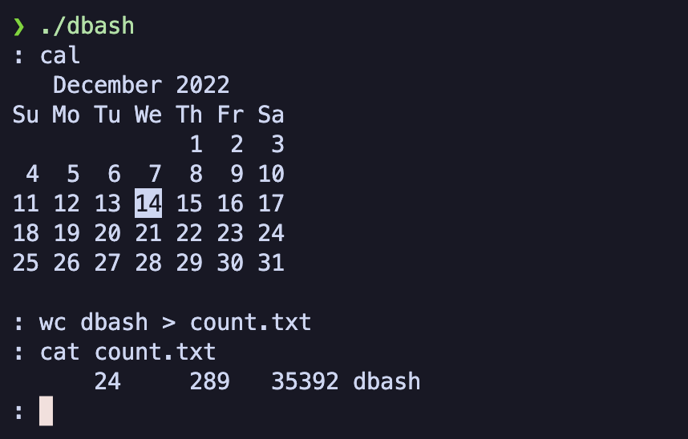

# dbash

donny bash = dbash

A worse version of every shell ever. At least it's not a fish.

All you can do is run processes through `PATH` in a similar way (and more limited way) than bash.

This was done for educational purposes. If you use this, you're a fool.

It really can't do anything other than redirecting stdin, std out; running existing commands, and running commands in the background.

## Usage



You may need to change the C compiler to gcc in the makefile. I used gcc-12.

**build executable**

```bash
make
```

**execute**

```bash
./dbash
```

Then you can run the commands on your system.
